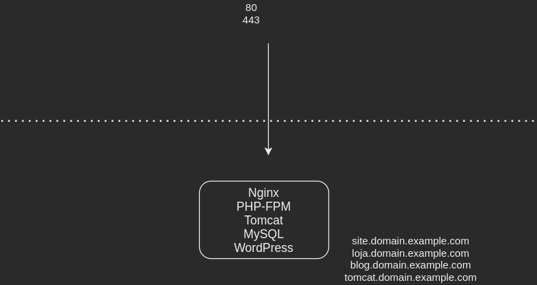
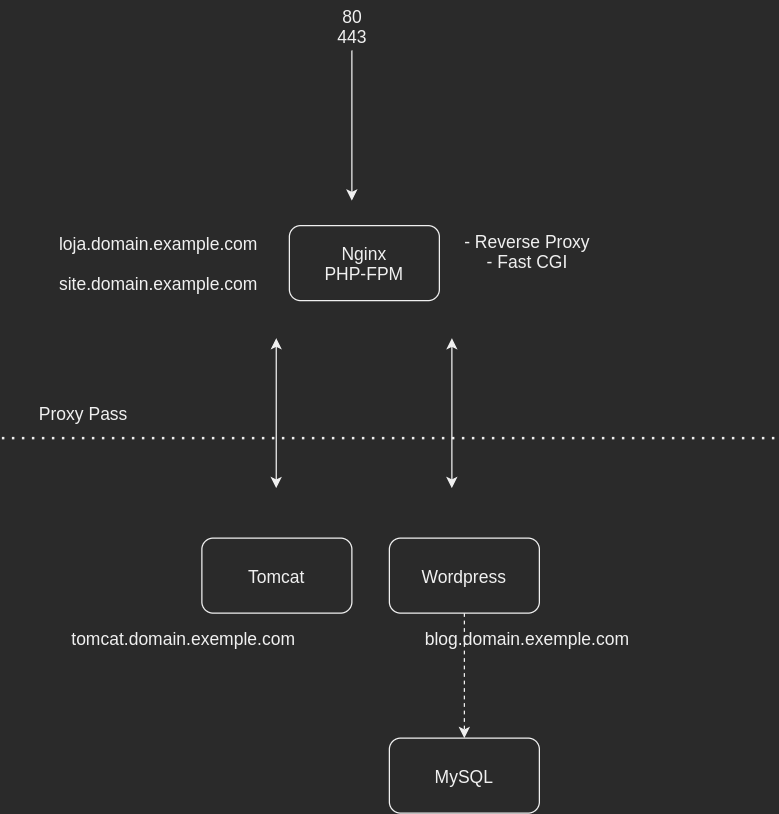

# Desafio 1

## Projeto

````
.
├── desafio01.pdf
├── LICENSE
├── README.md
└── terraform
    ├── main.tf
    ├── modules
    │   ├── instance
    │   │   ├── main.tf
    │   │   ├── output.tf
    │   │   ├── playbooks
    │   │   │   ├── installationPackages.sh
    │   │   │   ├── playbook.yaml
    │   │   │   └── settingsFiles
    │   │   │       ├── blogbiqueirabr.conf
    │   │   │       ├── blog.conf
    │   │   │       ├── index-loja.php
    │   │   │       ├── index-site.php
    │   │   │       ├── lojabiqueirabr.conf
    │   │   │       ├── loja.conf
    │   │   │       ├── nginx.conf
    │   │   │       ├── sitebiqueirabr.conf
    │   │   │       ├── site.conf
    │   │   │       ├── tomcat-reverseProxy.conf
    │   │   │       ├── tomcat.service
    │   │   │       └── wp-config.php
    │   │   └── variables.tf
    │   ├── route53
    │   │   ├── main.tf
    │   │   ├── output.tf
    │   │   └── variables.tf
    │   └── securityGroup
    │       ├── main.tf
    │       ├── output.tf
    │       └── variables.tf
    ├── modules.tf
    ├── output.tf
    └── variables.tf
````

## Arquitura monilitica




## Arquitetura com alta disponibilidade



## Ambiente

O terraform disponibiliza os seguinte recursos:

#### EC2

* Nginx
* PHP-FPM
* MySQL
* WordPress
* Tomcat

##### Nginx:
`worker_process`: numero de CPUs da maquina. Nesse caso de uma t2.micro foi utilizado o valor 1

`worker_connections`: numero de quisicoes simultaneas suportada por um worker_process. Utilizado 1024

`multi_accept`: Como yes. worker_process aceita uma nova conexao a qualquer momento 

`index`: .php e .html

`include`: server blocks em /etc/nginx/sites-enabled

Server Blocks:

Configuração basica para os sites. listen porta 80, server_name para o dominio que aquele server block espera conexao e
regra de tudo o que for php direciona para o fastcgi do php-fpm.

Com exceção a configuração do server block do tomcat, que foi feito o proxy reverso para 127.0.0.1:8080 a toda
requisicao para o dominio em questão.

##### PHP-FPM

Para cada site em PHP foi criado um arquivo de configuração especifico dentro de /etc/php-fpm.d, seguindo as seguintes
caracteristicas:

`listen`: cria um socket para o servico em /var/run/php-fpm/php-fpm-exemplo.socket

`user, group, listen.owner e listen.group`: nginx

##### MySql

Configuracao padrado do banco. Criacao da database e usuario para o wordpress

##### WordPress e Tomcat

Apenas instalação.

#### Route53

* Entradas tipo A para o dominio `biqueirabr.com.br`. Sendo elas:

**site.biqueirabr.com.br**

**loja.biqueirabr.com.br**

**blog.biqueirabr.com.br**

**tomcat.biqueirabr.com.br**

obs: Como já possuia um dominio no registro BR, então foi utilizado ele. Apenas alterei os servidores DNS do registro br
para os NS servers da AWS.

#### Security Group

* Regra de INBOUND de qualquer origem na porta 22;
* Regra de INBOUND de qualquer origem na porta 80;
* Regra de OUTBOUND de qualquer origem para qualquer destino.
